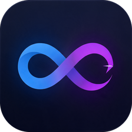
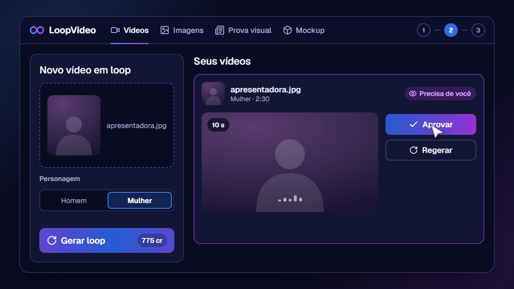
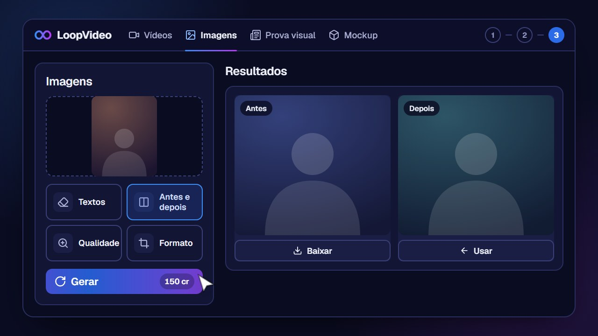
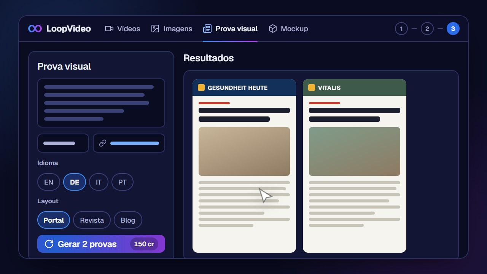
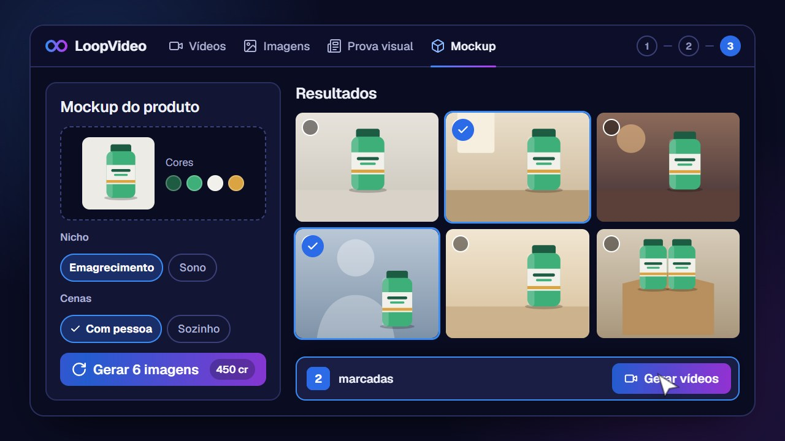

  

<h1 align="center">LoopVideo</h1>

  App para Windows que transforma <b>uma foto</b> num <b>vídeo da pessoa falando, em loop de 2:30</b>, sem corte aparente. 
  Junto vêm três ferramentas para criativos: <b>imagens</b>, <b>prova visual</b> e <b>mockup</b>.

  <a href="https://github.com/rafaguiar-dev/loopvideo/releases/latest"><b>⬇️ Baixar o LoopVideo</b></a>

## O que tem no app

<table>
  <tr>
    <td width="50%" valign="top">
      
      <h3>🎬 Vídeos em loop</h3>
      Solte a foto e escolha Homem ou Mulher. A IA gera a fala, o app emenda os trechos e entrega um MP4 de 2:30
      que volta ao começo sem pulo, pronto para fundo de VSL.  
      Antes de gastar o resto dos créditos, você aprova o vídeo principal. Já tem um vídeo? Solte no lugar da foto:
      o app só fecha o loop, pela metade do custo.
    </td>
    <td width="50%" valign="top">
      
      <h3>🖼️ Imagens</h3>
      Tira legenda e marca d'água, faz fotos de antes e depois, melhora a qualidade e muda o formato
      (9:16, 16:9, 4:5…).  
      Dá para encadear: o resultado de uma ferramenta vira a entrada da próxima.
    </td>
  </tr>
  <tr>
    <td width="50%" valign="top">
      
      <h3>📰 Prova visual</h3>
      Cole o texto de uma matéria (ou a copy do produto) e saia com uma página de portal, revista ou blog,
      no idioma que escolher.  
      Número e estudo só entram com fonte real.
    </td>
    <td width="50%" valign="top">
      
      <h3>📦 Mockup</h3>
      Suba a foto do pote, escolha o nicho e o tipo de cena. Saem imagens do produto em cena, sem texto no fundo.  
      Marque as melhores e elas viram vídeos curtos de 5 s.
    </td>
  </tr>
</table>

## No dia a dia

- **Fila:** solte várias fotos de uma vez; o app gera uma depois da outra.
- **Fechou no meio?** Ao abrir de novo, continua de onde parou.
- **Custo antes:** cada botão mostra quantos créditos vai gastar.
- **De fundo:** fica perto do relógio gerando enquanto você usa o PC. Com o sino ligado, o Windows avisa quando
  algo ficou pronto, deu erro ou precisa da sua aprovação.
- **Atualiza sozinho:** quando sai versão nova, é um clique.

## Instalar

1. Baixe o **`Instalar-LoopVideo-x.y.z.exe`** da [última release](https://github.com/rafaguiar-dev/loopvideo/releases/latest).
2. Execute. Não precisa de administrador; instala em `%LOCALAPPDATA%\LoopVideo` e cria o atalho.
3. Abra o LoopVideo e conecte sua conta Magnific (o login abre no navegador).

Na primeira vez, o Windows SmartScreen pode avisar "aplicativo desconhecido": clique em
**Mais informações → Executar assim mesmo**.

Para atualizar na mão, baixe o `Atualizar-LoopVideo-x.y.z.exe` da release e execute.

## Requisitos

- Windows 10 ou 11, 64 bits
- Internet
- Conta Magnific com créditos. Um loop a partir de foto custa cerca de 775 créditos; a partir de um vídeo seu,
  cerca de 325.

## Licença de uso

Uso interno ou sob autorização. Cada computador precisa ser liberado pelo administrador, que pode ativar ou
desativar máquinas a qualquer momento.

---

Desenvolvido por [rafaguiar.dev](https://rafaguiar-dev.github.io/).
